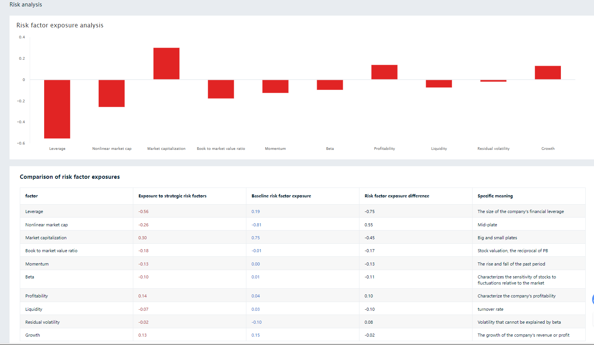
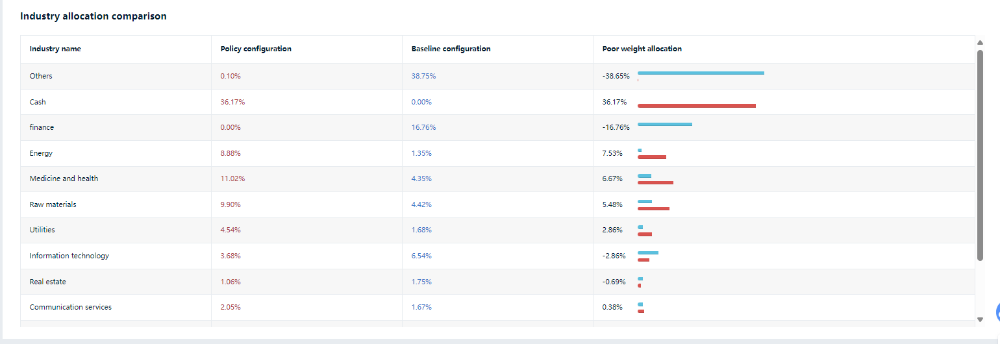
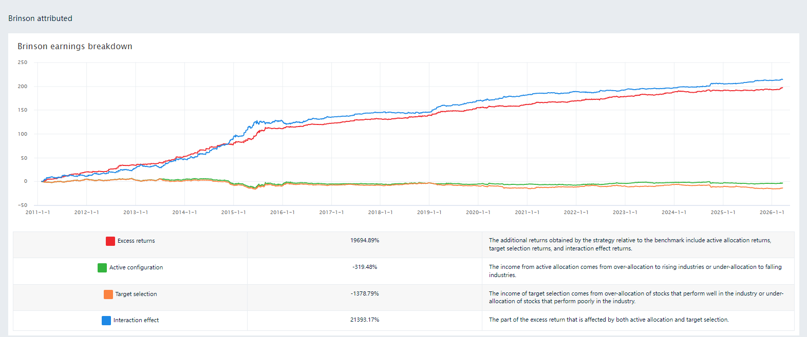

# Attribution Analysis Summary

## 1. Purpose

This document summarizes the attribution charts in the `Attribution analysis` folder and consolidates the main findings on performance, risk, style exposure, sector allocation, position structure, and trading behavior.

## 2. Executive Summary

The strategy shows strong long-term return generation, a solid risk-adjusted profile, and a relatively stable equity curve over a long sample period. Relative to the benchmark, the portfolio delivers meaningful excess return while keeping drawdowns at a manageable level.

The current attribution package is broad in coverage. It includes performance overview, drawdown analysis, rolling risk metrics, style exposure, sector allocation, Brinson attribution, top holdings, position contribution, and trading statistics. As a reporting package, it is already well structured and sufficiently detailed to support a full strategy review.

From a stricter attribution perspective, however, the package is still stronger in presentation than in causal explanation. Several charts clearly show what happened, but fewer charts clearly isolate why the excess return was generated and which return sources were persistent.

## 3. Key Performance Takeaways

Based on the net value overview charts, the main performance characteristics are:

- Annualized return: about `35%`
- Cumulative return: about `84.65`
- Annualized volatility: about `20%`
- Sharpe ratio: about `1.59`
- Calmar ratio: about `2.43`
- Maximum drawdown: about `15%`
- Information ratio: about `1.62`
- Alpha: about `0.32`
- Beta: about `0.49`

These numbers indicate strong absolute performance and strong risk-adjusted performance over the backtest horizon. The relatively low beta also suggests that the return profile is not primarily driven by passive market exposure.

## 4. Performance Analysis

### 4.1 Cumulative Return and Log Equity Curve

`Cumulative income & The cumulative income of the Iogarithmic line.png` shows that the strategy equity curve trends upward over the full sample period, while the log-scale curve remains broadly stable in slope. This suggests that performance is not concentrated in only a few isolated episodes.

### 4.2 Annual and Monthly Return Structure

`AnnualEarnings&MonthlyEarningsHeatmap&TimeSeriesOfMonthlyEarnings%MonthlyIncomeFrequencyDistributionChart.png` highlights several important features:

- Most calendar years are profitable
- `2018` stands out as a clearly weaker year
- The monthly return distribution is right-skewed overall
- Monthly volatility exists, but persistent extreme negative clustering is limited

Taken together, the time distribution of returns appears reasonably healthy.

## 5. Risk Analysis

### 5.1 Drawdown Profile

`Top_5_Retracement ranges.png` shows that the five largest drawdowns are concentrated in the roughly `12%` to `14.54%` range. The longest recovery period is meaningful but still acceptable for a strategy with this level of return.

This drawdown profile suggests:

- Drawdowns are contained rather than uncontrolled
- Stress periods are visible but not catastrophic
- Recovery capacity is reasonably strong

### 5.2 Risk-Adjusted Return

`Net Worth analysis-Benefits Overview 1.png` and `Net Worth analysis-Benefits Overview 2.png` indicate that the strategy maintains strong Sharpe, Calmar, Sortino, Tail Ratio, and Information Ratio metrics.

This implies:

- Return generation is not purely a function of taking excessive volatility
- Downside risk is controlled relatively well
- The return-to-risk trade-off is strong

### 5.3 Rolling Risk Indicators

`RollingBetaIndicators&RollingSharpeIndicator.png` shows that:

- Rolling beta is usually in a mid-to-low range
- Beta rises in some market phases, indicating time-varying market sensitivity
- Rolling 6-month Sharpe fluctuates but remains positive for large parts of the sample

This is consistent with a dynamic active equity strategy rather than a static exposure profile.

## 6. Style and Sector Attribution

### 6.1 Risk Factor Exposure

`RiskAnalysis.png` suggests that the strategy tends to exhibit:

- Low leverage exposure
- Lower beta exposure
- Lower liquidity exposure
- Positive profitability exposure
- Positive growth exposure
- Moderate large-cap bias

This combination is consistent with a quality-growth oriented active stock portfolio rather than a high-beta or highly levered return profile.

### 6.2 Style Exposure over Time

`StyleAnalysis.png` presents the time series of SMB, HML, RMW, and CMA exposures. The chart shows that style exposure changes through time rather than remaining fixed.

This is useful for describing portfolio style evolution. However, it is still an exposure chart rather than a direct return contribution chart. It explains how the portfolio is positioned, but not yet how much excess return each style factor contributed.

### 6.3 Sector Allocation

`sector_exposure_analysis.png` shows meaningful deviations from the benchmark across sectors. The portfolio appears overweight in areas such as energy, medicine and health, raw materials, and utilities, while underweight in sectors such as finance and information technology.

This supports the view that the strategy carries active sector bets. At the same time, the chart also shows a relatively high cash weight, which means the sector view should be interpreted together with the portfolio's cash management profile rather than as a pure sector-allocation result.

## 7. Brinson Attribution Assessment

`factor_attribution_brinson.png` is the most explicit attribution chart in the package. It decomposes excess return into active allocation, security selection, and interaction effects.

The chart is useful because it provides a formal attribution framework. However, the interpretation requires caution because the interaction term is exceptionally large relative to the allocation and selection components.

This raises several analytical questions:

- Whether excess return is being explained primarily through allocation-selection coupling
- Whether the attribution specification is amplifying the interaction term
- Whether sector classification, weight aggregation, or the attribution horizon is affecting interpretability

For reporting purposes, the chart is valuable. For research interpretation, it should be treated as one attribution view rather than the sole explanation of alpha generation.

## 8. Position and Trading Analysis

### 8.1 Position Concentration

`Top10HoldingsTable.png` shows that the maximum position weight of the top names is mostly around `23%` to `24%`. This indicates a relatively concentrated portfolio structure.

This concentration profile implies:

- Individual stock selection matters materially
- Correct high-conviction positions can contribute meaningfully to portfolio return
- Position-level mistakes can also have a visible impact on volatility and drawdown

### 8.2 Position Contribution

`Top10PositionIncomeTable.png` shows that return contribution is concentrated in a set of leading winners. This suggests that portfolio performance is driven in part by core winning holdings rather than by a very broad distribution of small gains.

### 8.3 Trading Statistics

`Position and Trading Statistics Table1.png` and `Position and Trading Statistics Table2.png` show:

- Total trades: about `1315`
- Profitable trades: about `699`
- Losing trades: about `614`
- Win rate: about `53.2%`
- Average holding period: about `19.39` days
- Average trade return: about `0.33%`
- Average gain on winning trades: about `1.22%`
- Average loss on losing trades: about `-0.69%`

This is a relatively healthy trading structure. The strategy does not rely on an extremely high hit rate. Instead, it combines a modestly positive win rate with a favorable gain-to-loss profile.

## 9. Trading Friction and Implementation Sensitivity

`Intraday earnings & The impact of slippage on the equity curve.png` is especially valuable from an implementation perspective. It shows that performance decays visibly as the assumed slippage level increases.

This implies:

- The strategy is sensitive to trading costs
- Execution quality matters materially
- Capacity and turnover need to be evaluated together with raw alpha

This chart adds practical credibility because it addresses implementation risk rather than focusing only on gross backtest returns.

## 10. Strengths of the Current Attribution Package

- Broad and well-organized chart coverage
- Strong long-horizon performance profile
- Clear drawdown and rolling-risk presentation
- Meaningful exposure views across style and sector dimensions
- Useful position and trading diagnostics
- Practical slippage sensitivity analysis

## 11. Main Limitations

- The package explains outcomes better than it isolates return drivers
- Brinson interaction effects are too dominant for a clean attribution narrative
- Style charts show exposure paths more clearly than return contribution
- Sector analysis is influenced by the portfolio's cash allocation
- Naming and presentation style across charts are not fully standardized

## 12. Suggested Next Steps

To strengthen the attribution framework further, the following additions would be useful:

- Year-by-year excess return decomposition
- Style factor contribution analysis, not only exposure analysis
- Separate sector allocation and within-sector stock selection contribution by period
- IC, Rank IC, and ICIR analysis for the core factors
- Turnover, transaction cost, and slippage loss attribution
- Cash drag and capital utilization analysis
- Regime-based attribution across different market environments

## 13. Chart Index

- `Cumulative income & The cumulative income of the Iogarithmic line.png`: cumulative return and log equity curve
- `Net Worth analysis-Benefits Overview 1.png`: main performance and risk indicators
- `Net Worth analysis-Benefits Overview 2.png`: supplementary distribution and risk-adjusted indicators
- `AnnualEarnings&MonthlyEarningsHeatmap&TimeSeriesOfMonthlyEarnings%MonthlyIncomeFrequencyDistributionChart.png`: annual return, monthly return, and monthly return distribution
- `Top_5_Retracement ranges.png`: top five drawdown periods
- `RollingBetaIndicators&RollingSharpeIndicator.png`: rolling beta and rolling Sharpe
- `RiskAnalysis.png`: risk factor exposure analysis
- `StyleAnalysis.png`: style exposure over time
- `sector_exposure_analysis.png`: sector allocation comparison
- `factor_attribution_brinson.png`: Brinson attribution
- `Top10Holdings.png`: top holdings over time
- `Top10HoldingsTable.png`: top holdings table
- `Top10PositionIncomeTable.png`: top position contribution table
- `Position and Trading Statistics Table1.png`: position and trading statistics
- `Position and Trading Statistics Table2.png`: return and trade count statistics
- `strategy_performance_metrics.png`: performance component display
- `Intraday earnings & The impact of slippage on the equity curve.png`: daily return and slippage sensitivity

## 14. Final Assessment

Overall, this attribution package is already strong enough to support a professional strategy review. It demonstrates strong performance, acceptable drawdown control, broad analytical coverage, and an effort to connect returns with portfolio structure and risk exposures.

The main area for improvement is attribution depth. The next step is to move from descriptive analysis toward tighter identification of repeatable return drivers across style, sector, selection, and execution dimensions.
