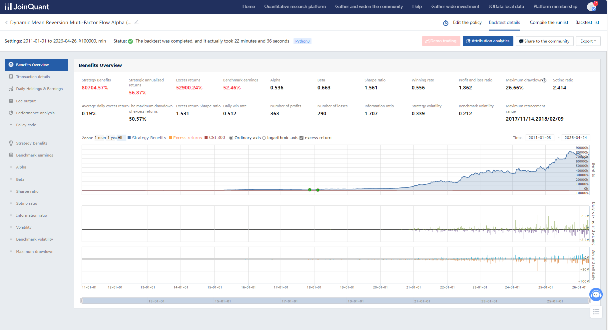

# A-Share Dynamic Mean Reversion & Multi-Factor Flow Alpha (DMR-MFA)

## Project Overview

`DMR-MFA` is an active quantitative trading strategy designed for the A-share market. Its core idea is to combine **dynamic market regime detection**, **short-term oversold rebound capture**, **main capital flow filtering**, and **technical exit confirmation** into a high-elasticity Alpha framework.

Based on the complete materials contained in this folder, the strategy does not rely on a single factor or a single style exposure. Instead, it generates returns through the coordinated interaction of several layers:

- Using `HS300 Bollinger Regime` to identify the market environment and dynamically adjust portfolio capacity
- Using `10-day downtrend + 3-day sharp drawdown` to identify oversold rebound candidates
- Using `net main inflow` to filter out rebound candidates without capital support
- Using `OBV divergence` and `BBI slope deterioration` as dynamic exit confirmations
- Using a fixed stock pool, equal-cash deployment, and hard take-profit / stop-loss rules to control overall portfolio rhythm

Taken together, the backtests, factor diagnostics, attribution reports, and modular code show that `DMR-MFA` is best described as a **dynamic mean-reversion + multi-factor flow filtering + active exposure adjustment** medium-frequency trading strategy.

## Strategy Framework

### 1. Market Regime Detection

The strategy uses `000300.XSHG` as the benchmark and classifies the market through a `20-day Bollinger Band` framework on the CSI 300:

- Above the upper band: increase portfolio holding capacity
- Inside the neutral zone: keep the base number of holdings
- Below the lower band: reduce portfolio holding capacity

According to the current code configuration, the target number of holdings dynamically shifts between `3 / 5 / 7`. This means the strategy is not continuously fully invested; instead, it actively adjusts overall risk exposure based on benchmark conditions.

### 2. Offensive Factors

The core factors around which the current research and implementation are built include:

- `HS300 Bollinger Regime`: market-state and holding-capacity adjustment factor
- `Ten-Day Downtrend`: medium-short weakness screening
- `Three-Day Drawdown`: short-term oversold rebound trigger
- `Net Main Inflow`: main capital flow filter
- `OBV Divergence`: volume-price divergence exit confirmation
- `BBI Slope`: trend deterioration exit confirmation

In practice, the buy-side logic is designed to look for rebound candidates within a fixed stock pool that satisfy the structure of **medium-term weakness + short-term sharp decline + strengthening capital flow**. The sell-side logic is layered around **hard take-profit / hard stop-loss / OBV divergence / BBI weakening**.

### 3. Risk Control and Execution

According to the default parameters in the modular code, the main execution constraints include:

- Fixed slippage: `0.2%`
- Take-profit threshold: `15%`
- Stop-loss threshold: `-3.5%`
- `OBV` divergence-based early profit lock is only activated once floating profit exceeds `1%`
- When drawdown approaches `-3%` and `BBI` slope turns negative, a dynamic technical exit is triggered

This design shows that the strategy prioritizes **return elasticity**, while using technical confirmation to reduce trailing drawdown risk rather than simply holding positions loosely to harvest trend continuation.

## Performance Overview

The project includes archived raw backtest outputs for multiple market regimes. The summary from `Backtest-Raw-Results/Performance_Summary.csv` is as follows:

| Backtest Period | Strategy Annualized Return | Benchmark Return (CSI 300) | Alpha | Beta | Sharpe | Sortino | Information Ratio | Max Drawdown | Profit/Loss Ratio | Winning Rate | Volatility |
| --- | --- | --- | --- | --- | --- | --- | --- | --- | --- | --- | --- |
| 2011-2026 (Long Term) | 56.87% | 52.46% | 0.536 | 0.663 | 1.561 | 2.414 | 1.707 | 26.66% | 1.862 | 0.556 | 0.339 |
| 2014-2015 (Bull / Volatile) | 151.34% | 60.13% | 1.325 | 0.637 | 3.381 | 5.071 | 3.068 | 31.04% | 2.670 | 0.692 | 0.436 |
| 2018 (Bear Market) | 10.76% | -25.31% | 0.275 | 0.694 | 0.176 | 0.282 | 1.018 | 22.72% | 1.177 | 0.389 | 0.384 |
| 2022-2024 (Sideways / Weak) | 33.87% | -20.35% | 0.376 | 0.672 | 0.921 | 1.584 | 1.356 | 21.14% | 1.588 | 0.472 | 0.324 |
| 2024-2026 (Recent) | 40.16% | 38.68% | 0.268 | 0.801 | 1.040 | 1.612 | 0.769 | 23.31% | 1.826 | 0.465 | 0.348 |

These results suggest that the defining characteristic of `DMR-MFA` is not perfectly smooth performance in every phase, but rather:

- Strong amplification potential in bull markets and high-elasticity environments
- The ability to preserve some positive return and relative defensiveness in bear or weak markets
- Strong long-term Alpha generation capability
- A Beta clearly below 1, though still meaningful, making it an actively exposed enhancement strategy rather than a low-beta defensive model

## Result Snapshots

### Long-Term Backtest Overview

### Cumulative Return and Logarithmic Equity Curve

### Annual and Monthly Return Distribution

### Risk Exposure Analysis

## Attribution Highlights

The `Attribution Analysis` folder already contains a complete set of attribution materials, together with a dedicated English summary at [Attribution Analysis/README.md](./Attribution%20Analysis/README.md). Based on those charts and detailed statistics, the main conclusions are:

1. The strategy has very strong long-term compounding ability and meaningfully outperforms the benchmark over time.
2. Excess return is not primarily driven by standalone industry allocation or standalone within-industry stock selection, but more clearly by the **interaction effect** between the two.
3. The portfolio has a structural tilt toward smaller-cap, highly liquid, high-elasticity, and relatively high-volatility stocks.
4. A meaningful portion of the total return is contributed by a relatively small number of strong winners, so return concentration is a major source of both upside and risk.
5. The strategy is somewhat sensitive to trading conditions and execution cost, but still retains strong Alpha capacity under standard slippage assumptions.

In profile terms, `DMR-MFA` is best understood as an active trading system jointly driven by:

`dynamic exposure adjustment + oversold rebound capture + capital flow filtering + technically confirmed exits`

## Factor Research System

The `Factor Analysis` folder contains JoinQuant research-environment-compatible notebooks for the major factors used by the strategy, including:

- `hs300_bollinger_regime_analysis.ipynb`
- `ten_day_downtrend_factor_analysis.ipynb`
- `three_day_drawdown_factor_analysis.ipynb`
- `net_main_inflow_factor_analysis.ipynb`
- `obv_divergence_factor_analysis.ipynb`
- `bbi_slope_factor_analysis.ipynb`
- `factor_correlation_diagnostic.ipynb`

These notebooks are not only used for standalone factor validity checks. More importantly, they are designed to:

- Examine factor distributions within the current stock universe
- Observe the relationship between factors and future returns
- Evaluate stability, tail behavior, and stratification quality
- Diagnose correlation and redundancy across factors

Among them, `factor_correlation_diagnostic.ipynb` is the key diagnostic notebook for understanding the cross-factor structure of the strategy, bridging single-factor research and multi-factor combination design.

## Code Structure

The `Code` folder contains both the complete integrated script and the modular reconstruction:

- `Complete_code.py`
- `modular_dmr_mfa/strategy_config.py`
- `modular_dmr_mfa/technical_factors.py`
- `modular_dmr_mfa/portfolio_construction.py`
- `modular_dmr_mfa/risk_controls.py`
- `modular_dmr_mfa/strategy_orchestrator.py`
- `modular_dmr_mfa/strategy_types.py`

The modular code separates the strategy into the following layers:

- `strategy_config.py`
  Handles benchmark settings, capacity parameters, stock pool definition, slippage, and exit thresholds
- `technical_factors.py`
  Implements technical diagnostics such as `HS300 Bollinger`, `OBV divergence`, and `BBI slope`
- `portfolio_construction.py`
  Manages candidate selection, holding pruning, equal-cash deployment, and target holding count updates
- `risk_controls.py`
  Applies take-profit, stop-loss, and technically confirmed exit rules
- `strategy_orchestrator.py`
  Connects initialization, pre-open handling, open-session rebalancing, intraday risk control, and post-close strategy flow

As a result, the project preserves both a directly comparable complete implementation and a more maintainable modular representation suitable for continued research and extension.

## Data and Result Directory Guide

### `Backtest-Raw-Results/`

Stores raw backtest outputs across different market regimes, including:

- `strategy_summary_metrics.csv`
- `daily_holdings_and_exposure.csv`
- `trade_execution_details.csv`
- Top-level `Performance_Summary.csv`

These files are suitable for:

- Regime-specific performance verification
- Trading behavior decomposition
- Holding and exposure review
- Additional visualization and post-processing

### `Result_Images/`

Stores summarized backtest result images for quick inspection of strategy performance across different market phases.

### `Factor Analysis/`

Stores research notebooks corresponding to the strategy’s factor library, covering both single-factor and multi-factor diagnostics.

### `Attribution Analysis/`

Stores the complete attribution outputs, including:

- Performance overview
- Annual and monthly return distribution
- Brinson attribution
- Style and risk exposure
- Position contribution
- Drawdown analysis
- Turnover, intraday return behavior, and slippage impact

### `Code/`

Stores both the original integrated script and the modular reconstruction, which together form the implementation layer of the strategy.

## Strategy Characteristics

Taking all contents in this folder together, `DMR-MFA` has several very distinct characteristics:

- It is built on a fixed core stock pool, but dynamically controls aggregate risk exposure through holding-capacity adjustment
- Its main offensive return source comes from oversold rebound capture and capital flow recovery
- It uses volume-price divergence and trend deterioration as exit confirmations
- Its long-term results are strong, but it is not a low-volatility or low-drawdown strategy
- It has high return elasticity and relatively high concentration, making it a good candidate for further capacity, execution cost, and concentration-risk optimization

## Typical Use Cases

This folder is suitable for several practical purposes:

- As a complete JoinQuant strategy research and backtest archive
- As a case study for mean-reversion-based multi-factor trading strategies
- As a reference example for migrating from a monolithic script to modular strategy engineering
- As a foundation for further enhancements in risk control, stock-pool optimization, and factor expansion

## Notes

- The `Code`, `Factor Analysis`, `Backtest-Raw-Results`, `Result_Images`, and `Attribution Analysis` directories are intentionally aligned so that the full path from research to implementation, backtest, and attribution can be reconstructed from this folder alone.
- This top-level README focuses on project-level orientation. For a more detailed attribution interpretation, see [Attribution Analysis/README.md](./Attribution%20Analysis/README.md).
