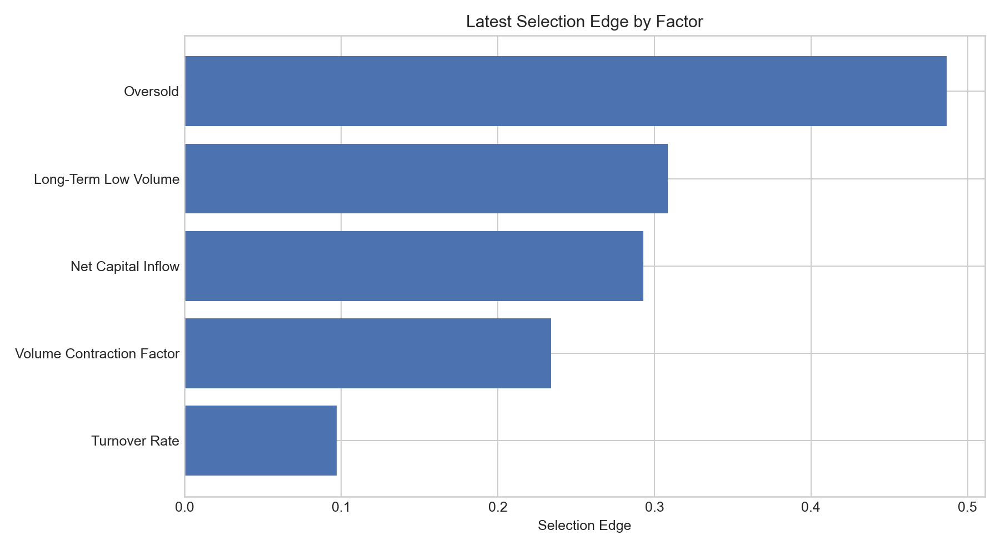
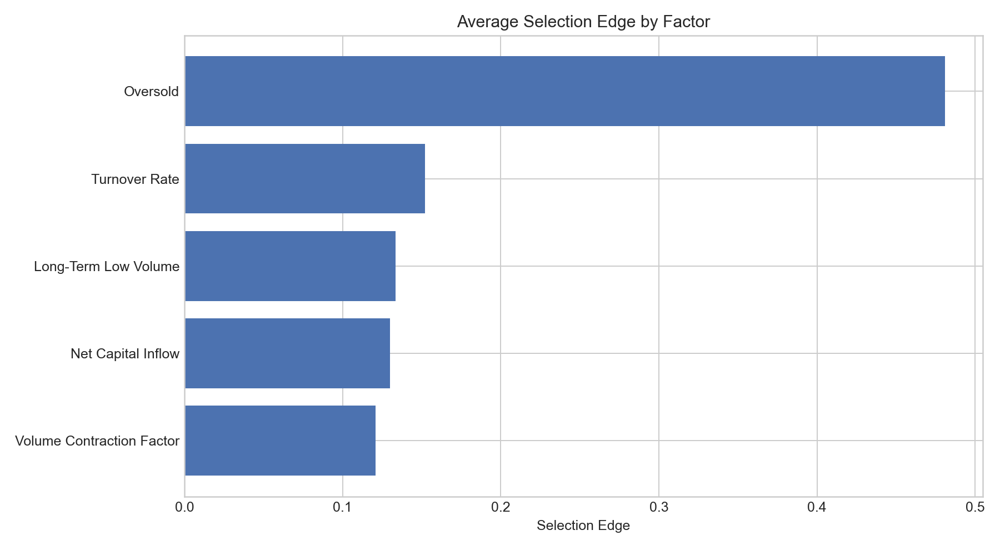

# Attribution Analysis

## Factor Selection Edge Summary

| Factor | Weight | Average Edge | Latest Edge | Average Rank IC |
| --- | --- | --- | --- | --- |
| Oversold | 0.7605 | 0.4808 | 0.4868 | -0.0288 |
| Oversold | 0.1267 | 0.4190 | 0.4488 | -0.0039 |
| Turnover Rate | 0.0444 | 0.1522 | 0.0973 | -0.0114 |
| Long-Term Low Volume | 0.0317 | 0.1334 | 0.3085 | -0.0253 |
| Net Capital Inflow | 0.0051 | 0.1300 | 0.2928 | -0.0420 |
| Volume Contraction Factor | 0.0317 | 0.1209 | 0.2342 | -0.0256 |

## Files

- `attribution_analysis_report.html`: interactive attribution dashboard.
- `factor_summary.csv`: summary table used for the selection-edge figures.
- `factor_attribution_timeseries.csv`: daily factor-attribution time series.
- `latest_holdings_snapshot.csv`: most recent holdings snapshot used in the attribution report.
