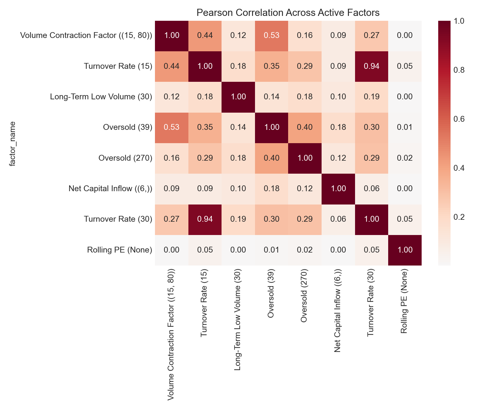

# Correlations

This folder contains cross-factor Pearson and Spearman correlation matrices for the active factor set used by the strategy.

- `pearson_correlation.csv` / `pearson_correlation.html`: linear dependence across the active factors.
- `spearman_correlation.csv` / `spearman_correlation.html`: rank-based dependence across the active factors.
