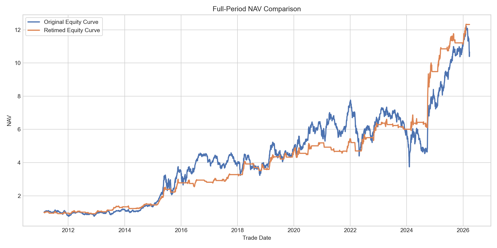
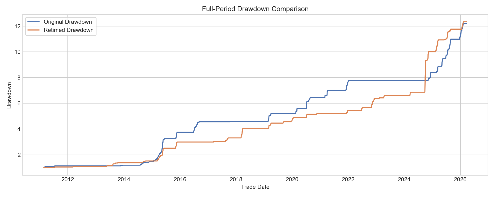

# Full Period

## Performance Summary

| Version | Cumulative NAV | Annual Return | Max Drawdown | Return / Drawdown |
| --- | --- | --- | --- | --- |
| Original | 10.66 | 16.97% | -51.78% | 0.33 |
| Retimed | 12.32 | 18.10% | -16.58% | 1.09 |

## Contents

- `Performance`: equity-curve CSV/HTML outputs and summary metrics for both the original and retimed versions.
- `Holdings`: holding-market-cap visual diagnostics from the original result directory.
- `Selections`: selection snapshots and latest selection exports.
