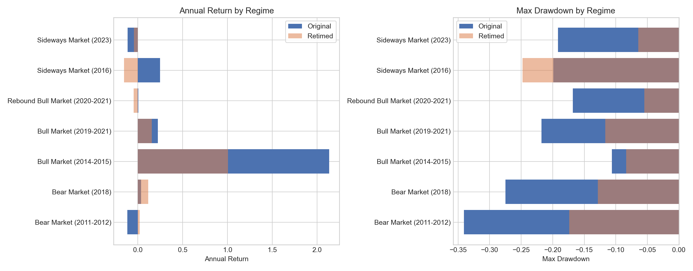

# Market Regimes

## Regime Comparison

| Regime | Original Return | Original Max DD | Original NAV | Retimed Return | Retimed Max DD |
| --- | --- | --- | --- | --- | --- |
| Bear Market (2011-2012) | -11.83% | -34.09% | 0.81 | 2.00% | -17.38% |
| Bear Market (2018) | 3.74% | -27.50% | 1.03 | 11.50% | -12.84% |
| Bull Market (2014-2015) | 213.48% | -10.64% | 2.93 | 100.47% | -8.37% |
| Bull Market (2019-2021) | 22.45% | -21.78% | 1.54 | 15.46% | -11.67% |
| Rebound Bull Market (2020-2021) | 0.63% | -16.82% | 1.0 | -4.58% | -5.48% |
| Sideways Market (2016) | 24.77% | -19.90% | 1.24 | -15.53% | -24.77% |
| Sideways Market (2023) | -11.29% | -19.17% | 0.89 | -4.41% | -6.44% |

## Included Windows

- `bear_market_2011_2012`: prolonged post-crisis downtrend.
- `bear_market_2018`: sharp deleveraging and trade-war drawdown phase.
- `bull_market_2014_2015`: classic leverage-driven A-share bull market.
- `bull_market_2019_2021`: broad recovery and liquidity-supported uptrend.
- `rebound_bull_market_2020_2021`: post-shock rebound with persistent momentum.
- `sideways_market_2016`: range-bound consolidation year.
- `sideways_market_2023`: later-cycle sideways and weak-trend environment.
