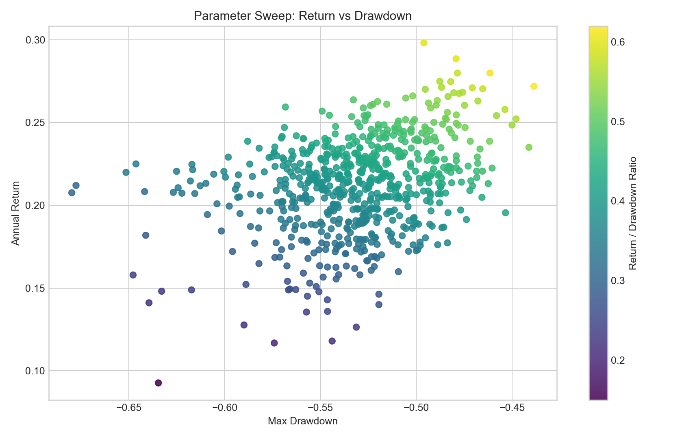
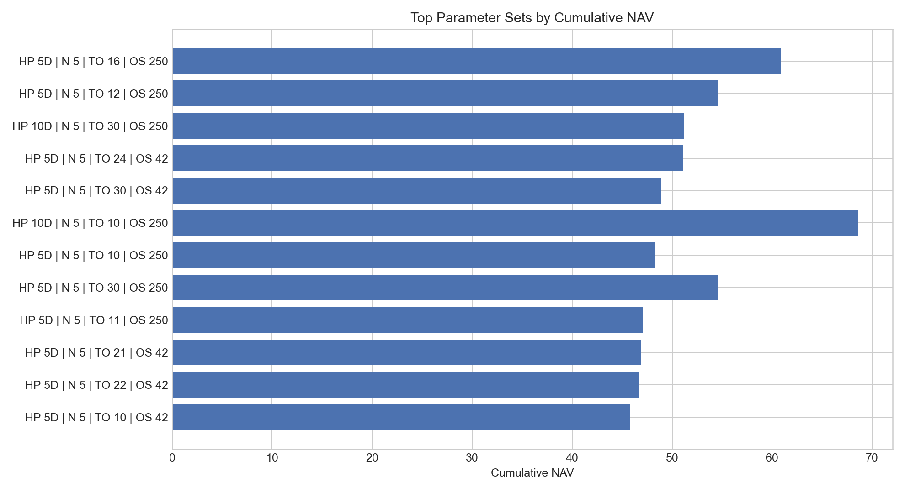

# Parameter Sweep

## Best Configurations by Return / Drawdown

| Combo | Hold | N | Turnover | Oversold | NAV | Annual Return | Max DD | R/DD |
| --- | --- | --- | --- | --- | --- | --- | --- | --- |
| 545 | 10D | 5 | 10 | 250 | 49.26 | 27.19% | -43.86% | 0.62 |
| 131 | 5D | 5 | 12 | 250 | 54.57 | 27.99% | -46.15% | 0.61 |
| 481 | 10D | 5 | 10 | 250 | 68.62 | 29.81% | -49.60% | 0.6 |
| 151 | 5D | 5 | 16 | 250 | 60.83 | 28.85% | -47.92% | 0.6 |
| 181 | 5D | 5 | 30 | 250 | 54.55 | 27.99% | -47.85% | 0.58 |
| 497 | 10D | 5 | 10 | 250 | 48.71 | 27.10% | -47.07% | 0.58 |
| 209 | 5D | 5 | 10 | 250 | 48.35 | 27.04% | -46.53% | 0.58 |
| 541 | 10D | 5 | 22 | 42 | 41.21 | 25.79% | -45.37% | 0.57 |
| 207 | 5D | 5 | 24 | 42 | 51.06 | 27.47% | -48.20% | 0.57 |
| 203 | 5D | 5 | 20 | 42 | 43.99 | 26.30% | -46.78% | 0.56 |

## Notes

- The summary table is sourced from the original parameter-scan workbook and the original per-combination result directories.
- `factor_turnover_rate` and `factor_oversold` are the scanned factor-parameter dimensions that dominate the robustness picture in this packaged subset.
