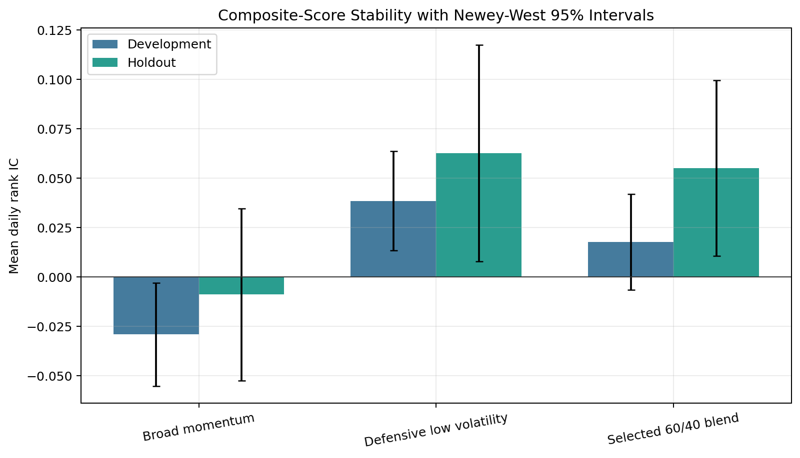
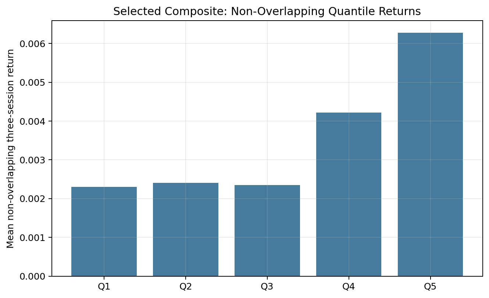
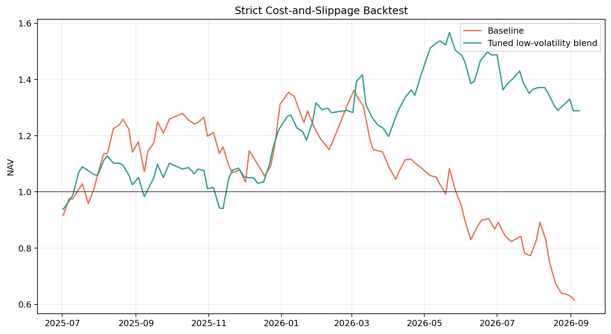
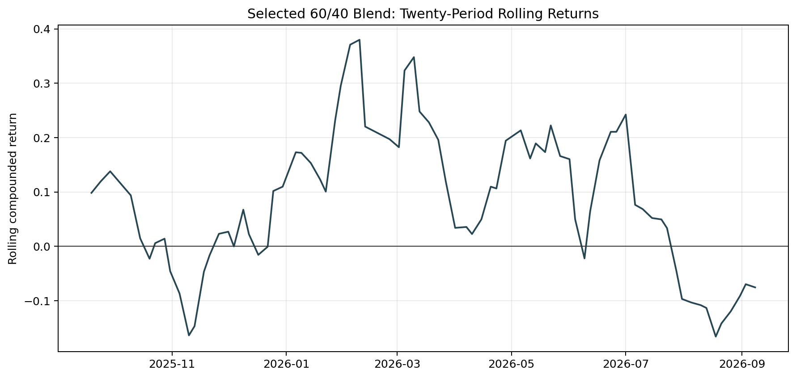
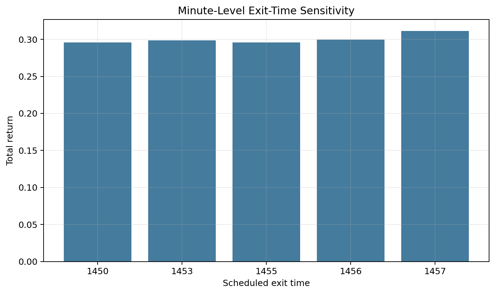
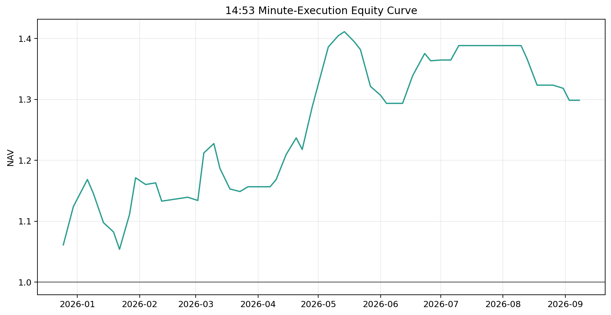
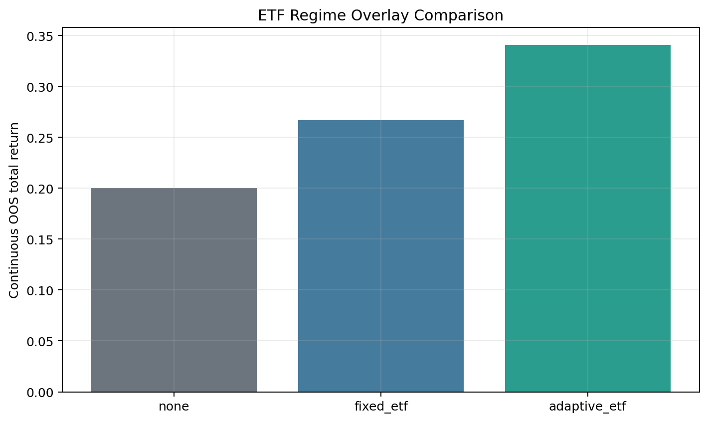
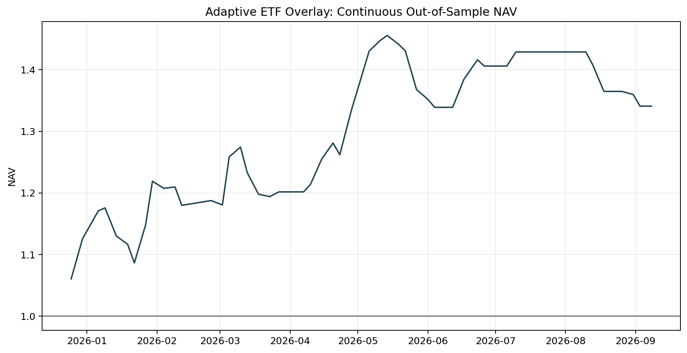
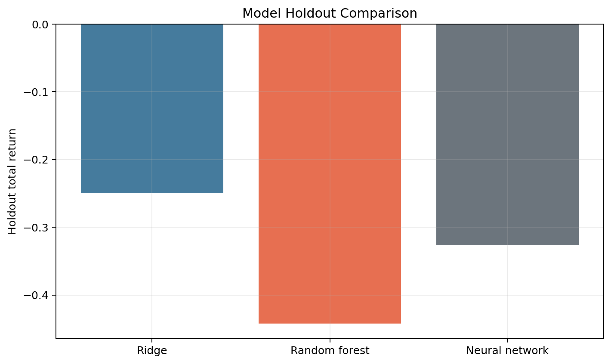

# A股短周期動量研究系統

[English version](README.md)

呢個項目係一套由研究去到執行嘅A股短周期量化系統，完整保留數據對齊、因子診斷、模型比較、交易成本回測、分鐘成交、樣本外驗證、ETF市況風控同執行安全控制。

## 項目概覽

- **研究問題：** 日頻同分鐘市場結構，可唔可以喺計入A股實際交易成本之後，建立可靠嘅三交易日橫截面排序訊號？
- **最終設計：** 60%防守低波動分數加40%廣義動量分數，每期最多三隻股票，分鐘級成交，同埋ETF自適應倉位。
- **證據狀態：** 現有樣本跑贏選定市場基準，但未足以聲稱係長期穩定或者機構級驗證嘅alpha。


## 核心結果

| 測試 | 實際可用區間 | 總回報 | 最大回撤 | 解讀 |
|---|---:|---:|---:|---|
| 嚴格調優版本 | 2025-07-02 至 2026-09-08 | 28.87% | -17.75% | 買賣各30 bps不利滑點，包含佣金同印花稅 |
| 鎖參數留出樣本 | 2026-04-01 至 2026-09-08 | 6.09% | -20.77% | 留出期係正回報，但風險仍然明顯 |
| 14:53分鐘成交 | 2025-12-25 至 2026-09-08 | 29.86% | -9.81% | 57個可用週期，98.41%可以喺指定分鐘成交 |
| 自適應ETF連續樣本外 | 2025-12-25 至 2026-09-08 | 34.10% | -8.02% | 每段測試唔使用當期結果揀參數 |
| 無ETF風控對照 | 2025-12-25 至 2026-09-08 | 20.03% | -18.31% | 同一測試序列嘅直接對照 |

以上係研究模擬，唔係經審計嘅實盤業績。

## 核心證據

### 1. 因子方向同統計穩定性

原本嘅廣義動量分數喺現有樣本較弱。較可靠嘅部分係防守分數：偏好尾市回報、實現波動、日內振幅同VWAP距離較低，同時保留早段強勢。最終混合分數保留防守效果，但冇完全放棄動量信息。



- 防守分數全樣本平均Rank IC係`0.0474`，Newey-West `t=3.59`。
- 最終60/40混合分數全樣本平均IC係`0.0316`，`t=2.71`。
- 混合分數喺鎖參數留出期平均IC係`0.0551`，`t=2.43`。

非重疊分箱將三交易日標籤分成三組獨立日曆序列，避免將重疊回報當成每日獨立持倉複利。



三組留出樣本嘅Q5-Q1都係正數，單調度係`0.9`、`0.9`同`1.0`。但每組只有36至37個觀察值，個別t值只係`1.16`至`1.52`。

### 2. 嚴格資金回測同滾動穩定性

嚴格回測包括有限資金、100股整手、最低佣金、印花稅、價格限制，同埋買賣各30 bps不利滑點。





最終版本喺78個二十期滾動窗口入面有`71.8%`係正回報，中位數係`7.25%`，最差窗口係`-16.60%`。結果明顯好過基線，但唔係每種市況都賺錢。

### 3. 分鐘級成交

賣出時間只喺預先設定嘅窄範圍入面測試，而唔係任意搜索全日分鐘。最終使用14:53，兼顧執行時間同現有樣本回報，亦避免依賴最後幾分鐘。





分鐘數據可以提高價格精度，但仍然無法重現排隊次序、部分成交、撤單同分鐘內價格路徑。

### 4. ETF市況風控同市場基準

ETF廣度喺交易日`t`收市後計算，下一個交易日先開始生效。Nested rolling selection只喺預先設定嘅廣度、確認日數、ETF範圍同倉位方案入面選擇。





喺實際共同區間，自適應策略回報係`34.10%`，五個寬基同成長ETF基準係`-3.07%`至`17.76%`。策略最大回撤亦低過全部選定基準。


呢個結果只證明現有共同樣本入面跑贏，唔係長期alpha迴歸，亦未完全排除基準選擇同市況選擇風險。

### 5. 模型比較保留負面結果

Ridge、Random Forest同多層神經網絡都使用帶embargo嘅walk-forward預測。三個模型喺鎖定留出期都表現較差，所以最終保留結構較簡單嘅固定混合分數。



保留失敗模型可以完整交代研究選擇路徑，避免只展示有利結果。

## 可重現範圍

| 範圍 | 倉庫支持 | 所需資料 |
|---|---|---|
| 安裝套件同執行測試 | 完整可重現 | Python 3.10或者3.11 |
| 重新生成所有公開圖表 | 完整可重現 | 倉庫內聚合結果表 |
| 重新計因子、IC同分箱 | 有數據即可重現 | 標準化日線同一分鐘行情 |
| 重新生成walk-forward模型預測 | 有數據即可重現 | 因子面板 |
| 執行通用交易成本回測 | 有數據即可重現 | 包含分數同買賣價格嘅候選表 |
| 精確重現首頁全部結果 | 單靠公開倉庫無法完成 | 受授權限制嘅原始行情同原研究輸入 |
| 執行實盤券商交易 | 刻意排除 | 私人登入資料、賬戶狀態同供應商環境 |

快速驗證：

```bash
python -m venv .venv
.venv\Scripts\activate
pip install -e .[dev]
pytest
python scripts/generate_report_assets.py
```

原始行情受數據供應商授權限制，所以唔會放入公開倉庫。完整界線見[數據格式](docs/DATA_CONTRACT.md)同[重現說明](docs/REPRODUCIBILITY.yue.md)。

## 目錄結構

```text
configs/                 公開研究參數
docs/                    方法、數據格式、質素判斷同限制
results/figures/          README直接展示嘅研究證據圖
results/tables/           聚合結果、穩健性表同研究決策記錄
scripts/                  重現同圖表生成入口
src/ashare_momentum/      數據、因子、模型、風控、回測同執行模組
tests/                    時點、持倉歸屬同統計驗證測試
```

根目錄README只直接展示影響研究結論嘅圖。其他敏感度表同歷史比較保留喺[研究結果索引](results/README.yue.md)。

## 研究控制

- 訊號時間一定早過成交時間。
- 三交易日標籤使用相同長度embargo同HAC調整推斷。
- 當日ETF資料只可以影響下一個交易日倉位。
- 回測包括整手、最低佣金、印花稅同不利滑點。
- 持倉歸屬邏輯只可以賣出策略管理股數，唔會影響原有持倉。
- 公開文件冇賬戶編號、登入資料、實盤訂單、持倉、電腦路徑或者券商日誌。

## 最終解讀

呢個係一個較強嘅研究工程同作品集項目，策略統計證據屬於中等。主要限制係分鐘同連續OOS只有57期、ETF nested test只有六折，以及部分歷史測試冇完整point-in-time股票池。要聲稱有可持續alpha，仍然需要更長嘅未接觸forward結果同完整日期化股票池。

完整技術記錄見[研究方法](docs/METHODOLOGY.md)、[研究質素判斷](docs/RESEARCH_QUALITY.md)同[限制](docs/LIMITATIONS.md)。
