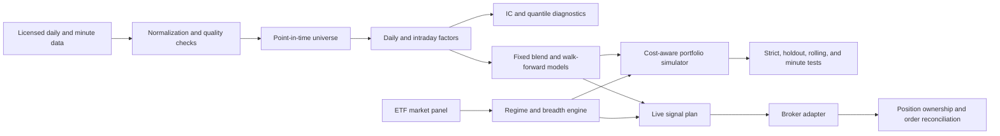

# System Architecture

The public repository keeps the broker adapter boundary abstract. Broker credentials, account identifiers, local terminal paths, live state, and order history are not part of the research artifact.

