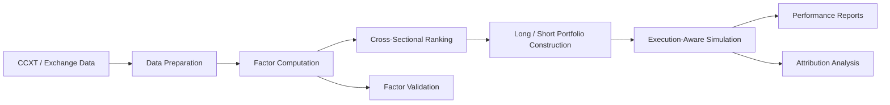

# Cross-Sectional Crypto Strategy Research

> A portfolio-style research showcase for a systematic cryptocurrency long/short strategy built on directly crawled exchange data, modular factor research, and execution-aware backtesting.

## Overview

This folder is the research homepage for my crypto systematic strategy work. It is organized as a full quant research package rather than a collection of isolated plots:

- a runnable strategy engine in [`Code/`](./Code)
- factor research outputs in [`Factor Analysis/`](./Factor%20Analysis)
- portfolio attribution outputs in [`attribution_analysis/`](./attribution_analysis)
- exported backtest snapshots in [`2021-2026_Backtest_Result/`](./2021-2026_Backtest_Result) and [`2026.1-2026.3_Backtest_Result/`](./2026.1-2026.3_Backtest_Result)
- a reliability and reusability memo in [`reliability.md`](./reliability.md)

The objective is to show not only that the strategy produced attractive backtest numbers, but also how the research was structured, why the signal stack is credible, and how the framework can be reused for future crypto strategies.

## Interview Snapshot

### Key Results

- `2021-01` to `2026-03`: cumulative net value `16.62`, annualized return `71.44%`, max drawdown `-13.40%`
- attribution summary: annualized return `65.13%`, volatility `22.66%`, Sharpe `2.33`
- average long count `25.57`, average short count `25.71`, showing diversified cross-sectional construction
- strongest current standalone factor is `W42`, while weaker factors are still preserved transparently

### Why It's Credible

- factor evidence is evaluated with IC, IC decay, monotonicity, turnover, and realized long/short portfolio diagnostics
- simulation includes fees, funding, lot-size constraints, and liquidation checks
- weak and mixed-quality factors are kept in the research record, reducing cherry-picking risk
- attribution and reliability notes make the framework easier to audit than a one-equity-curve showcase

### Main Risks

- still depends on configurable local data paths rather than a fully bundled public package
- slippage and market impact are simplified relative to full production trading
- data completeness and survivorship control depend on the quality of the local exchange archive

## Strategy At A Glance

| Item | Description |
| --- | --- |
| Market | Binance spot and perpetual futures |
| Data source | Direct exchange data collected through the CCXT-based workflow |
| Input frequency | Hourly bars |
| Strategy type | Cross-sectional long/short selection |
| Holding period | 21 days |
| Core alpha stack | `W24`, `W22`, `W42`, `PctChange` |
| Universe filters | `QuoteVolumeMean`, `VolumeMeanRatio` |
| Execution controls | Fees, funding, lot sizes, liquidation threshold, offset aggregation |

## Research Architecture



## What Makes This Project Different

### It is not just a backtest export

This repository is structured around the full research loop:

1. raw market data normalization
2. modular factor generation
3. liquidity and eligibility filtering
4. cross-sectional ranking and long/short selection
5. execution-aware portfolio simulation
6. factor diagnostics and post-trade attribution

### It models crypto-specific frictions

The framework explicitly accounts for:

- spot and perpetual fee schedules
- perpetual funding payments
- minimum tradable quantity constraints
- liquidation threshold checks
- offset-based overlapping holding windows

### It keeps both signal and implementation in view

The factor layer and the portfolio layer are evaluated separately, so a factor is not treated as "good" unless it remains useful after portfolio construction and turnover effects.

## Performance Snapshot

### Full Sample Backtest

Source: [`2021-2026_Backtest_Result/Strategy_Performance_Metrics.csv`](./2021-2026_Backtest_Result/Strategy_Performance_Metrics.csv)

| Window | Cumulative Net Value | Annualized Return | Max Drawdown | Return / Drawdown | Win Rate |
| --- | --- | --- | --- | --- | --- |
| 2021-01 to 2026-03 | `16.62` | `71.44%` | `-13.40%` | `5.33` | `55.51%` |

### Recent Sample Backtest

Source: [`2026.1-2026.3_Backtest_Result/Strategy_Performance_Metrics.csv`](./2026.1-2026.3_Backtest_Result/Strategy_Performance_Metrics.csv)

| Window | Cumulative Net Value | Annualized Return | Max Drawdown | Return / Drawdown | Win Rate |
| --- | --- | --- | --- | --- | --- |
| 2026-01 to 2026-03 | `1.21` | `149.54%` | `-4.01%` | `37.27` | `60.26%` |

### Attribution Summary

Source: [`attribution_analysis/strategy_summary.csv`](./attribution_analysis/strategy_summary.csv)

| Metric | Value |
| --- | --- |
| Symbols covered | `512` |
| Annualized return | `65.13%` |
| Annualized volatility | `22.66%` |
| Sharpe | `2.33` |
| Max drawdown | `-12.61%` |
| Average turnover | `0.0897` |
| Average long count | `25.57` |
| Average short count | `25.71` |

These results are presented as research evidence, not as a claim of guaranteed live performance. The validation logic behind them is documented in [`reliability.md`](./reliability.md).

## Factor Research Highlights

The factor stack was evaluated through cross-sectional statistics and realized portfolio outcomes rather than by narrative alone.

Source: [`Factor Analysis/factor_summary.csv`](./Factor%20Analysis/factor_summary.csv)

| Factor | Role | Observation |
| --- | --- | --- |
| `W42_(0.01, 0.99, True)` | selection factor | strongest standalone factor in the current pack, with robust IC and realized long/short portfolio performance |
| `QuoteVolumeMean_13` | filter | useful as a liquidity or conditioning filter, not just a return predictor |
| `CompositeFactor` | portfolio factor | positive overall portfolio profile, supported by per-factor diagnostics |
| `W24`, `PctChange`, `W22` | candidate inputs | included transparently even when performance is weaker, which reduces cherry-picking risk |

## Repository Guide

### [`Code/`](./Code)

The runnable research engine. This includes data preparation, factor calculation, selection logic, simulation, and report export.

### [`Factor Analysis/`](./Factor%20Analysis)

Signal-level validation, including IC, IC decay, monotonicity, turnover, and long/short portfolio diagnostics.

### [`attribution_analysis/`](./attribution_analysis)

Portfolio-level decomposition by component, side, symbol, time bucket, offset sleeve, and regime.

### [`reliability.md`](./reliability.md)

The formal note explaining why the framework is credible, what controls are already implemented, what assumptions remain, and how the same framework can be reused for new signals.

## End-To-End Workflow

```text
Exchange data -> data normalization -> factor matrix -> cross-sectional ranking
-> long/short target weights -> offset aggregation -> execution-aware simulation
-> performance report + attribution report + factor diagnostics
```

## Why This Works As A Quant Portfolio Page

- It shows a complete research pipeline, not just a final equity curve.
- It makes factor evidence and realized portfolio evidence visible at the same time.
- It demonstrates crypto-specific implementation awareness.
- It exposes both strengths and weaknesses of the factor set, which is more credible than one-way marketing language.
- It provides a reusable base for future factor, timing, or allocation research.

## Why This Is More Than A Good-Looking Backtest

The strongest claim for this project is not that the current factor pack is permanently correct. The stronger claim is that the framework makes false discovery easier to detect than in a typical crypto backtest showcase.

Evidence against simple overfitting includes:

- factor quality is evaluated with IC, IC decay, monotonicity, turnover, and realized long/short portfolio diagnostics
- weak and mixed-quality factors are preserved in the research record rather than hidden
- portfolio simulation includes fees, funding, lot-size constraints, and liquidation checks
- attribution outputs make it possible to inspect side-level, symbol-level, and time-bucket contribution
- the reliability memo documents known limitations rather than pretending the framework is production-perfect

Residual risks are still acknowledged:

- the package still depends on configurable local data paths
- slippage and market impact are simplified relative to full production execution
- survivorship and data-completeness checks depend on the local exchange archive

That balance of evidence and caveats is the main reason this project is presented as a serious research framework rather than only a high-return result snapshot.

## Reproducibility Notes

The current package is a research-ready core, not yet a fully self-contained public release. To run it locally:

1. update raw data paths in [`Code/config.py`](./Code/config.py)
2. install the required Python dependencies
3. prepare exchange metadata such as minimum tradable quantities if needed
4. run:

```bash
python Code/backtest.py
```

## Recommended Reading Order

1. [`reliability.md`](./reliability.md)
2. [`Code/README.md`](./Code/README.md)
3. [`Factor Analysis/README.md`](./Factor%20Analysis/README.md)
4. [`attribution_analysis/README.md`](./attribution_analysis/README.md)
5. the result folders and HTML equity curves
