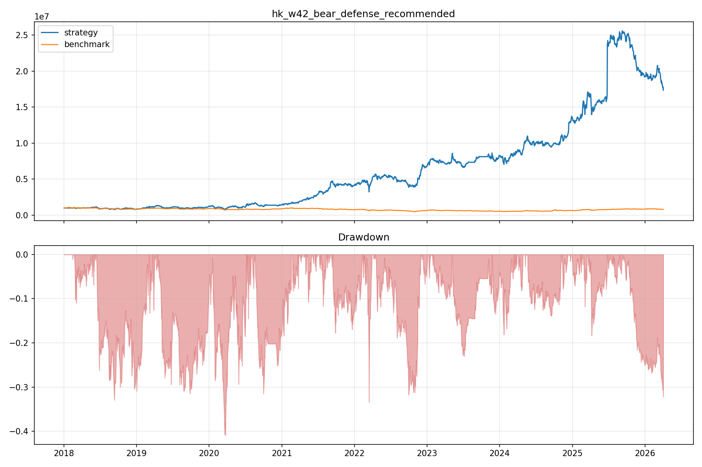
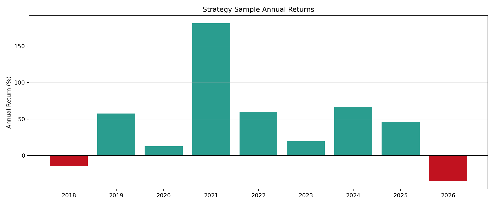
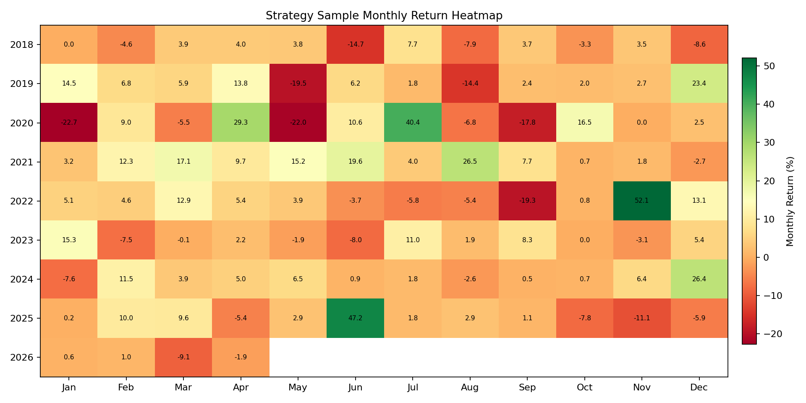
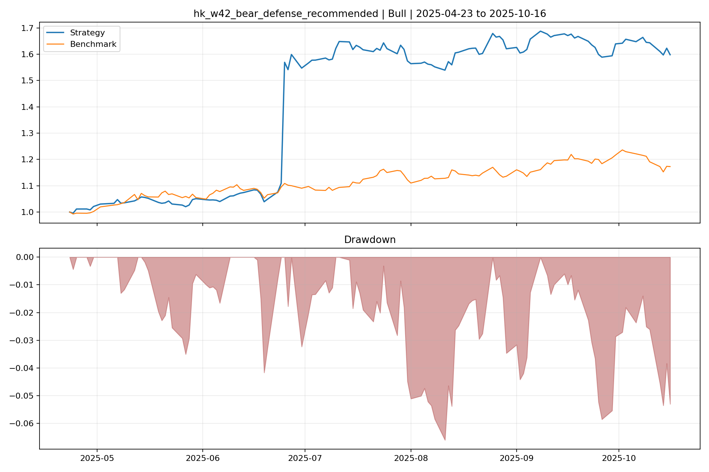
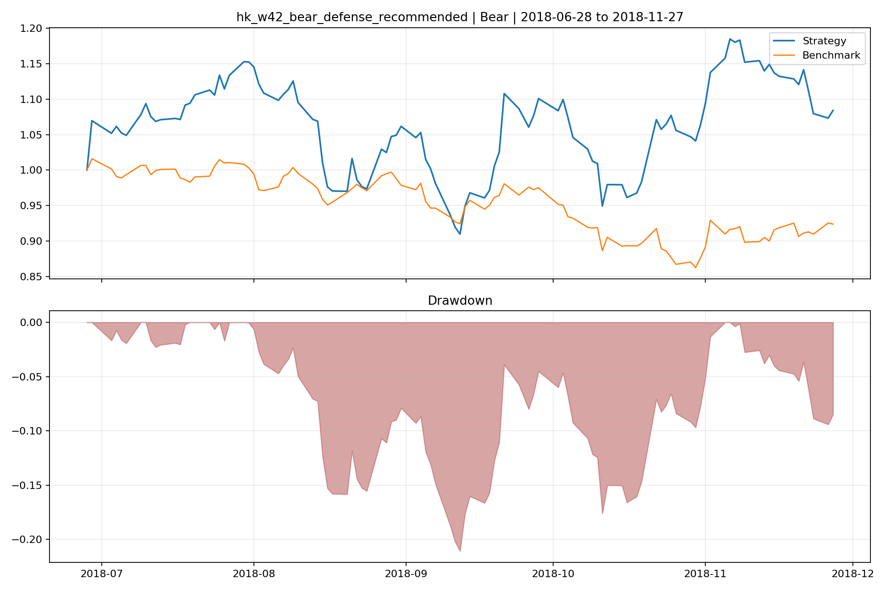
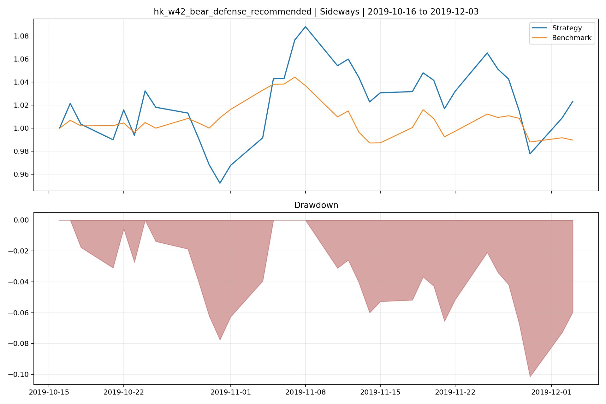
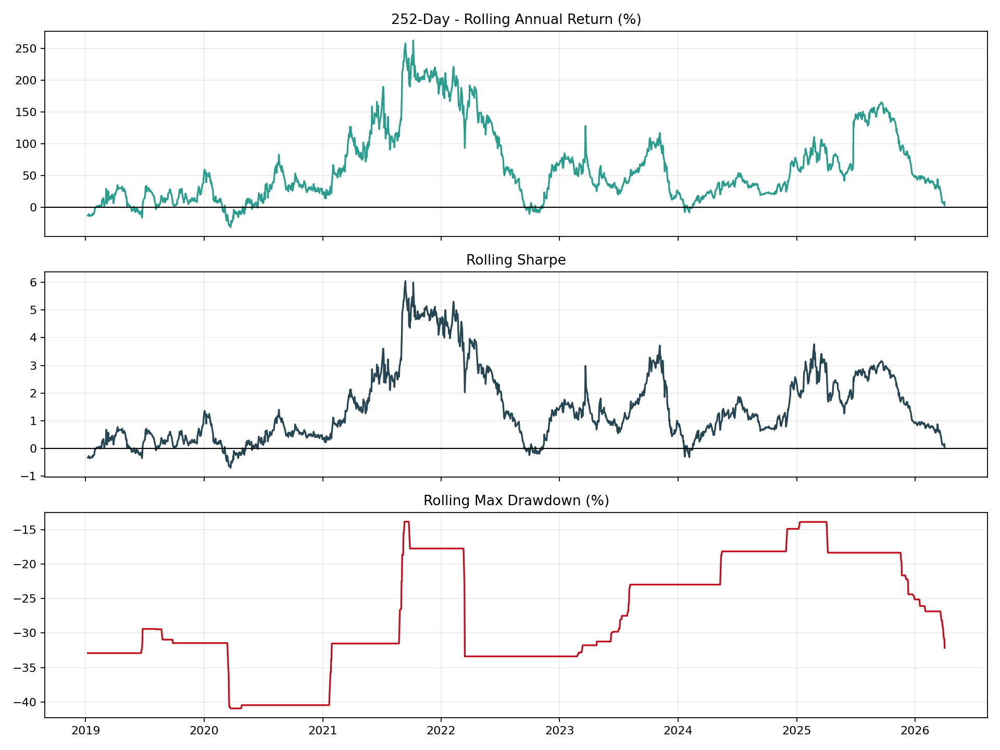
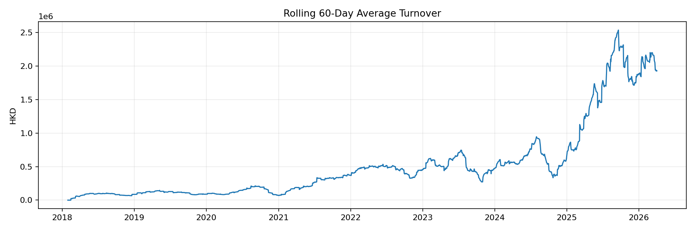

# HK Strategy

Hong Kong cross-sectional equity strategy research package built on a package-local `vectorbt` / `Backtrader` framework with explicit Hong Kong execution assumptions. The repository is structured as a self-contained research dossier: strategy definition, reproducible code, package-local data snapshot, raw backtest exports, factor diagnostics, attribution analysis, and stability evidence.

## Research Scope

The strategy targets short- to medium-horizon upside in Hong Kong equities through a ranked long-only portfolio. The core hypothesis is that a Hong Kong-specific microstructure-style factor (`W-42`) can be improved by adding measured trend confirmation, modest liquidity awareness, and a small amount of price/volume structure validation.

The active research sample presented in this package is `2018-01-02` to `2026-04-02`. Earlier historical windows are intentionally excluded from the package narrative so that all reported artifacts refer to the same reviewed sample.

## Interview Snapshot

### Key Results

- sample `2018-01-02` to `2026-04-02`: total return `1636.86%`, annual return `42.38%`
- Sharpe `0.9677`, max drawdown `-40.91%`, benchmark total return `-17.69%`
- profitable representative windows are preserved across bull, bear, and sideways slices
- this is the cleanest standalone Hong Kong package in the repository from a reproducibility perspective

### Why It's Credible

- factor stack is decomposed into separate diagnostics with correlation and coverage analysis
- simulation models Hong Kong-specific frictions such as board lots, participation caps, slippage, and fees
- raw backtest exports, attribution outputs, and rolling stability diagnostics are preserved
- the package is runnable from package-local code and package-local data, which improves auditability

### Main Risks

- concentrated long-only portfolio with only `5` holdings, so path dependence is meaningful
- current headline Sharpe is acceptable but not overwhelming, so robustness still matters a lot
- broader validation outside the packaged sample would strengthen the external credibility case

## Research Snapshot

| Item | Value |
|---|---|
| Universe | All locally available Hong Kong equities in the package data snapshot |
| Portfolio style | Long-only, equal-weight, cross-sectional rank selection |
| Holdings | Top 5 names |
| Rebalance | Every 15 trading days |
| Signal delay | 1 trading day |
| Trade price | Next-day open |
| Benchmark | Hang Seng Index |
| Bear overlay | Exposure reduced to `0.90` when benchmark is below 120-day MA |

## Headline Results

| Metric | Strategy Sample |
|---|---:|
| Total return | `1636.86%` |
| Annual return | `42.38%` |
| Annual volatility | `43.79%` |
| Sharpe | `0.9677` |
| Max drawdown | `-40.91%` |
| Calmar | `1.0358` |
| Benchmark total return | `-17.69%` |

## Strategy Construction

### Active Factor Stack

| Factor | Weight | Coverage | Role | Interpretation |
|---|---:|---:|---|---|
| `W-42` | 20.00 | 75.71% | Core alpha | Prefers names whose VWAP-vs-close structure suggests latent strength and rapid re-pricing pressure. |
| `returns_momentum(21)` | 0.60 | 76.15% | Trend confirmation | Rewards positive one-month continuation. |
| `price_vs_ma(20)` | 0.60 | 72.54% | Trend position | Rewards names trading above their 20-day moving average with positive distance. |
| `trend_compression_score(9, 1, -2%, +1%)` | 0.10 | 76.55% | Setup quality | Rewards restrained 1-day movement inside an already positive 9-day trend. |
| `avg_amount_level(3)` | 0.35 | 74.00% | Tradability | Rewards higher recent turnover and better execution capacity. |
| `bbi_upturn_score([5,10,12,21], 1)` | 0.16 | 72.04% | Early slope signal | Rewards early improvement in a composite BBI trend structure. |
| `obv_bottom_rising_score(12, 4, 2)` | 0.04 | 76.73% | Volume-flow confirmation | Rewards OBV recovery from the lower part of its recent range. |

### Factor Design Rationale

- `W-42` remains the dominant ranking driver and is intentionally given far larger weight than the confirmation factors.
- `returns_momentum` and `price_vs_ma` validate that the microstructure signal is not fighting an already weak short-term trend.
- `trend_compression_score` acts as a small setup-quality adjustment rather than a hard filter, avoiding unnecessary universe shrinkage.
- `avg_amount_level` is included because Hong Kong execution quality varies materially across the cross-section.
- `bbi_upturn_score` and `obv_bottom_rising_score` are kept as small secondary terms because they overlap with trend/momentum information and are intended to refine timing rather than replace the main alpha source.

## Factor Interaction Evidence

The active factor set is not treated as a bag of unrelated signals. Correlation and coverage diagnostics are included to keep the stack interpretable.

- `W-42` has only weak rank correlation with `returns_momentum` (`-0.04`) and `price_vs_ma` (`-0.05`), which is consistent with it contributing distinct information.
- `avg_amount_level` is negatively correlated with `W-42` (`-0.31`), providing a useful tradability offset rather than duplicating the primary alpha.
- `price_vs_ma` and `bbi_upturn_score` are highly correlated (`0.96`), which is why BBI remains a light-weight confirmation term instead of a large allocation driver.

## Performance Summary

### Full Sample

### Year-Level Behavior

The annual profile is uneven but coherent with a high-beta, concentrated long-only process:

- strongest years include `2021` (`181.38%`) and `2024` (`66.78%`)
- weak years include `2018` (`-14.36%`) and the partial `2026` sample (`-35.18%` annualized over a short window)
- the portfolio remained profitable in `2022`, a difficult Hong Kong tape, with `59.55%` annual return

### Representative Market Regimes

| Period | Regime | Start | End | Annual Return | Max Drawdown | Benchmark Return |
|---|---|---|---|---:|---:|---:|
| `strategy_sample` | strategy sample | 2018-01-02 | 2026-04-02 | 42.38% | -40.91% | -17.69% |
| `bull_01` | bull | 2025-04-23 | 2025-10-16 | 163.35% | -6.61% | 17.29% |
| `bull_02` | bull | 2020-11-05 | 2021-03-23 | 91.81% | -9.28% | 10.90% |
| `bear_01` | bear | 2018-06-28 | 2018-11-27 | 21.38% | -21.07% | -7.60% |
| `bear_02` | bear | 2022-07-11 | 2022-11-29 | 37.74% | -27.50% | -13.82% |
| `sideways_01` | sideways | 2019-10-16 | 2019-12-03 | 18.07% | -10.15% | -1.02% |

## Execution Realism

The framework does not assume frictionless end-of-day execution. The simulation applies Hong Kong-specific implementation constraints at the portfolio level.

| Assumption | Setting |
|---|---|
| Trade timing | Signal formed on day `t`, executed on day `t+1` |
| Execution price | Next-day open |
| Board lots | Rounded to board lots, default `500` shares with name-specific overrides |
| Minimum tradable amount | `HKD 2.0m` base threshold |
| Participation cap | `5%` of daily volume and `5%` of daily amount |
| Base slippage | `15 bps` |
| Impact slippage at max participation | `35 bps` |
| Fees | Commission, platform fee, stamp duty, levy, trading fee, settlement fee, AFRC levy |

This design is meant to avoid overstating capacity in the low-liquidity tail of the Hong Kong market.

## Stability and Capacity

The package includes rolling and regime-level stability diagnostics rather than relying on a single full-sample Sharpe.

- sample trading cost: `HKD 2.37m`
- cumulative turnover: `HKD 1.10bn`
- trade count: `9,101`
- average daily turnover ratio: `4.95%`

## Why This Is More Than A Sample-Specific Backtest

This package is not presented as proof that the strategy must work live forever. The stronger claim is that the research process is explicit enough to let a reviewer challenge whether the edge is real.

Evidence against simple overfitting includes:

- the active factor stack is decomposed into separate diagnostics rather than hidden inside one composite score
- cross-factor correlation and coverage analysis are included so signal overlap is visible
- execution assumptions are Hong Kong-specific, including board lots, participation caps, slippage, and fees
- rolling and regime-level stability charts are included instead of relying only on the full-sample result
- the package preserves attribution, raw backtest exports, and package-local data used for the reported sample

Residual risks still matter:

- the strategy is concentrated, with only `5` holdings, so path dependence remains meaningful
- the reported Sharpe is respectable but not so high that overfitting risk can be ignored
- broader historical and external validation beyond the packaged sample would still strengthen the claim

In other words, the package is meant to show a serious and auditable Hong Kong research workflow, not to hide uncertainty behind one attractive chart.

## Repository Structure

- [Result_Images](Result_Images): full-sample and regime-level equity charts
- [Factor Analysis](Factor%20Analysis): single-factor IC, quantile, coverage, and cross-factor correlation diagnostics
- [Backtest-Raw-Result](Backtest-Raw-Result): raw holdings, trades, returns, and cost exports for the reported sample and representative sub-periods
- [Attribution Analysis](Attribution%20Analysis): realized contribution analysis using actual portfolio weights
- [Stability](Stability): rolling metrics, turnover, overlap, and bear-overlay robustness diagnostics
- [Code](Code): package-local framework, configs, and runnable scripts
- [HK Data](HK%20Data): package-local stock and index data snapshot with English index filenames
- [Reproducibility.md](Reproducibility.md): exact steps to reproduce the reported outputs

## Suggested Review Order

1. Read this file for the strategy definition, factor rationale, execution assumptions, and reported results.
2. Inspect [Factor Analysis](Factor%20Analysis) for per-factor quality, rank correlation, and coverage.
3. Inspect [Stability](Stability) for rolling behavior, turnover, and robustness.
4. Inspect [Attribution Analysis](Attribution%20Analysis) and [Backtest-Raw-Result](Backtest-Raw-Result) for realized position-level evidence.
5. Inspect [Code](Code) and [Reproducibility.md](Reproducibility.md) for implementation and reproduction details.
