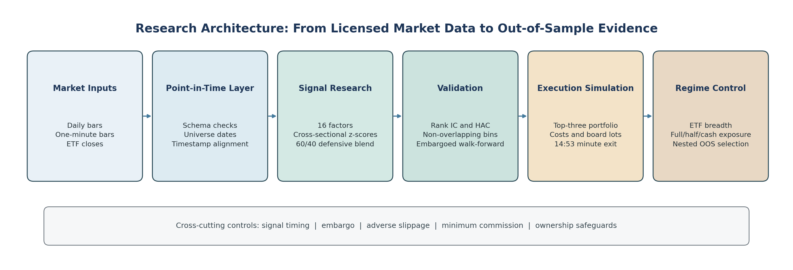
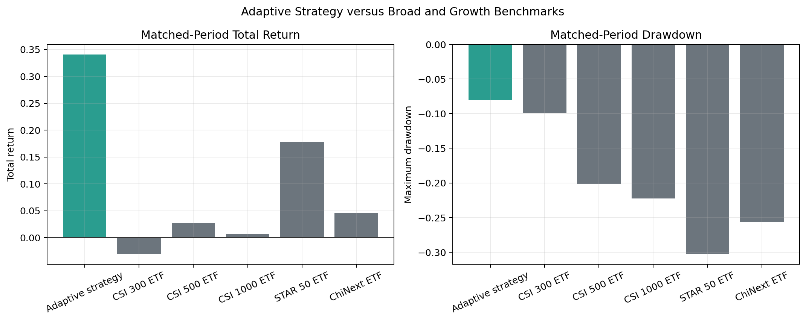

# Quant Trading Strategies

Cross-asset quantitative research portfolio spanning A-shares, Hong Kong equities, and cryptocurrency markets.

This repository is organized as an interview-facing research portfolio rather than a loose collection of backtests. The goal is to show cross-market research ability across five flagship projects, led by a fully documented A-share short-horizon research and execution system:

| Project | Market | Style | What it demonstrates |
| --- | --- | --- | --- |
| **`A-Share Momentum System`** | **China A-shares** | **defensive intraday ranking with ETF regime control** | **HAC factor validation, minute execution, nested OOS testing, and research-package reproducibility** |
| `A-Share 1` | China A-shares | multi-factor stock selection | full-stack alpha research, portfolio construction, live-execution awareness |
| `A-Share 2` | China A-shares | dynamic mean reversion | regime-aware exposure control, rebound capture, execution-sensitive exits |
| `HK Strategy` | Hong Kong equities | cross-sectional long-only | Hong Kong microstructure awareness, board-lot and cost modeling, package-local reproducibility |
| `Crypto Strategy` | crypto spot and perps | cross-sectional long/short | cross-asset factor research, execution-aware simulation, reusable data and portfolio engine |

## What Makes This Repository Different

- It covers multiple asset classes rather than one backtest style.
- It preserves the full research chain: `idea -> factor design -> portfolio construction -> backtest -> attribution -> robustness`.
- It keeps both presentation-friendly charts and raw exported artifacts such as trades, holdings, and summary tables.
- It shows different research paradigms instead of repeating one ranking recipe across markets.

## Flagship Projects

### 1. A-Share Short-Horizon Momentum Research System — Primary Flagship

Path: [`Ashare-momentum-TradingSystem`](./Ashare-momentum-TradingSystem)

This is the primary flagship because it presents the clearest complete research chain in the repository. It starts from daily and one-minute market structure, tests 16 cross-sectional factors, documents why a defensive low-volatility blend replaced the weaker broad momentum signal, and carries the selected specification through strict costs, minute execution, rolling windows, locked holdout tests, ETF regime control, and matched-period benchmarks.



Selected evidence:

- defensive score mean Rank IC `0.0474` with Newey-West `t=3.59`
- selected 60/40 blend holdout IC `0.0551` with Newey-West `t=2.43`
- adaptive ETF continuous OOS return `34.10%` with `-8.02%` maximum drawdown over 57 usable periods
- direct comparison against five broad and growth ETF benchmarks over the same observed interval
- explicit disclosure of short samples, survivorship-bias risk, unsuccessful machine-learning models, and exact reproduction boundaries



Why it matters:

- strongest combination of statistical validation, execution realism, and honest limitations
- most complete standalone research package, including bilingual documentation, CI, tests, data contracts, and artifact hashes
- best starting point for discussing research judgment rather than only headline returns

### 2. A-Share Cross-Factor Alpha Research & Live Execution System

Path: [`A-Share-Strategies/1.A-Share Cross-Factor Alpha Research & Live Execution System`](./A-Share-Strategies/1.A-Share%20Cross-Factor%20Alpha%20Research%20&%20Live%20Execution%20System)

This is the repository's main fundamental and industry-overlay A-share project. It combines technical, fundamental, and industry signals into a medium-frequency stock-selection system with explicit risk controls, archived backtests, attribution analysis, and QMT signal-forwarding awareness.

Why it matters:

- strongest example of combining fundamental and technical A-share signals
- clear example of end-to-end systematic equity research
- easiest project to discuss in a QR interview from both research and implementation angles

### 3. A-Share Dynamic Mean Reversion & Multi-Factor Flow Alpha (DMR-MFA)

Path: [`A-Share-Strategies/2.A-Share Dynamic Mean Reversion & Multi-Factor Flow Alpha (DMR-MFA)`](./A-Share-Strategies/2.A-Share%20Dynamic%20Mean%20Reversion%20&%20Multi-Factor%20Flow%20Alpha%20%28DMR-MFA%29)

This project focuses on oversold rebound capture with regime-aware capacity changes, main-capital-flow confirmation, and execution-sensitive exits. It is intentionally more aggressive than the first A-share project and is presented as a higher-elasticity trading system rather than a low-volatility enhancement model.

Why it matters:

- shows a distinct active-trading research framework, not just another factor ranker
- demonstrates entry, exit, and capacity logic working together
- helps show breadth across different alpha styles inside the same market

### 4. HK Strategy

Path: [`HK Strategy`](./HK%20Strategy)

This package presents a Hong Kong equity strategy with explicit treatment of local trading frictions, board-lot assumptions, participation caps, slippage, and benchmark-aware exposure adjustments. It is the cleanest standalone package in the repository from a reproducibility perspective.

Why it matters:

- directly relevant to Hong Kong quant interviews
- shows that the research approach transfers beyond A-shares
- demonstrates market-specific execution modeling instead of reusing mainland assumptions

### 5. Cryptocurrency Market Strategy

Path: [`Cryptocurrency market strategy`](./Cryptocurrency%20market%20strategy)

This project is a reusable cross-sectional crypto research engine using directly collected exchange data, modular factor diagnostics, liquidity filters, and execution-aware long/short simulation across spot and perpetual markets.

Why it matters:

- shows cross-asset portability of the research workflow
- demonstrates understanding of crypto-specific frictions such as funding, lot sizes, and liquidation constraints
- proves the repository is not limited to one market's APIs or one factor template

## Cross-Asset Research Capability

Taken together, these five projects are meant to show:

- cross-sectional factor research in both mainland and offshore equities
- regime-aware active trading research in A-shares
- execution-aware simulation under different market structures
- portability of research workflows across stock and crypto datasets
- willingness to preserve negative evidence, implementation caveats, and robustness work rather than only headline returns

## Why This Repository Is More Than Curve Fitting

This repository does not claim that every strategy is fully production-proven. The stronger and more defensible claim is that the research process is inspectable and less vulnerable to naive overfitting than a typical student backtest archive.

Repository-level evidence against pure overfitting includes:

- multiple market-regime slices are preserved rather than only the best sample window
- `Stability` directories archive parameter, cost, universe, and implementation sensitivity tests
- raw holdings, trade, and exposure exports are kept alongside summary charts
- attribution layers make it possible to inspect concentration, side-level contribution, and behavior through time
- several project READMEs explicitly document limitations, not only strengths

At the same time, residual risks are stated honestly:

- some A-share strategies still rely on JoinQuant-specific APIs
- not every project is equally detached from local data or platform assumptions
- some strategies still need stronger out-of-sample protocol writeups or ablation summaries

## Suggested Reading Order

If you only have time to review the strongest work:

1. [`A-Share Momentum System`](./Ashare-momentum-TradingSystem)
2. [`A-Share 1`](./A-Share-Strategies/1.A-Share%20Cross-Factor%20Alpha%20Research%20&%20Live%20Execution%20System)
3. [`A-Share 2`](./A-Share-Strategies/2.A-Share%20Dynamic%20Mean%20Reversion%20&%20Multi-Factor%20Flow%20Alpha%20%28DMR-MFA%29)
4. [`HK Strategy`](./HK%20Strategy)
5. [`Crypto Strategy`](./Cryptocurrency%20market%20strategy)

If you want the fastest understanding of the repository structure:

1. read the project README
2. inspect reproducibility notes
3. inspect code and configuration
4. inspect performance summary artifacts
5. inspect attribution and stability evidence

## Top-Level Structure

```text
Quant-Trading-Strategies/
|- Ashare-momentum-TradingSystem/
|- A-Share-Strategies/
|  |- 1.A-Share Cross-Factor Alpha Research & Live Execution System/
|  |- 2.A-Share Dynamic Mean Reversion & Multi-Factor Flow Alpha (DMR-MFA)/
|  `- 3.A-Share Oversold-Rebound-Timing-Strategy/
|- HK Strategy/
`- Cryptocurrency market strategy/
```

## Intended Use

This repository is best read as a research portfolio for quantitative research interviews. The emphasis is not only on whether a backtest looks strong, but on whether the research workflow, implementation assumptions, and robustness evidence are serious enough to support technical discussion.
